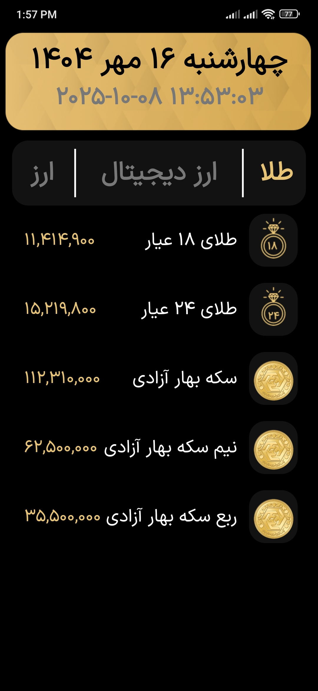
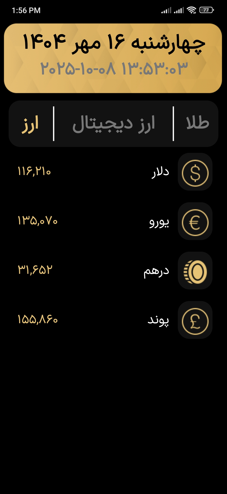

# 💰 Gold Market Live

This is my **second Android project**, created around **July 2024**.  
The main goal of this project was to **learn how to use the Retrofit library** for networking and to **handle threading with Call and Callback mechanisms**.

---

## 📘 Overview
**Gold Market Live** is a simple Android app that displays **real-time prices of gold, coins, and foreign currencies (like USD)**.  
The app fetches live market data from an online API using **Retrofit**, and updates the user interface dynamically.

This project helped me understand how to:
- Make HTTP requests in Android
- Parse JSON data into Kotlin models
- Handle background threads and network responses properly
- Display real-time data in a clean and user-friendly layout

---

## 🧠 What I Learned
- Fundamentals of **Retrofit** and REST APIs  
- Managing **threads** with Call and Callback in Retrofit  
- Parsing and displaying **JSON responses**  
- Building simple, dynamic UIs with XML and Kotlin  

---

## 📸 Screenshots
Below are some screenshots of the app 👇  

---

## 🛠️ Tech Stack
- **Language:** Kotlin  
- **UI:** XML Layouts  
- **Networking:** Retrofit  
- **Thread Handling:** Call / Callback  

